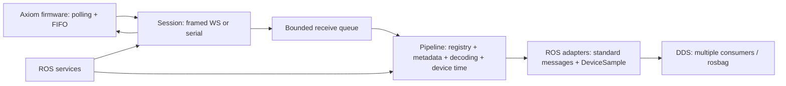

# Axiom ROS 2

Robotical's Axiom ROS 2 driver and tools.

Tested stack: Ubuntu 24.04, ROS 2 Jazzy. Transports: USB serial and framed
WebSocket (`/ws`). One driver instance per Axiom.

## Build on Linux

Requires ROS 2 Jazzy, `rosdep` and `colcon`. Run from the repository root:

```bash
source /opt/ros/jazzy/setup.bash
rosdep install --from-paths src --ignore-src -r -y
colcon build --base-paths src --symlink-install
source install/setup.bash
```

Source ROS and `install/setup.bash` in each ROS terminal.

## Machine and board configuration

Keep local settings in two files, both ignored by Git:

```bash
cp config/machine.env.example config/machine.env
cp config/boards.yaml.example config/boards.yaml
```

Edit `machine.env` for the ROS setup script, workspace, DDS domain and dashboard
port. The workspace defaults to this checkout, independent of the terminal's
current directory. Jazzy is the default underlay; set `ROS_SETUP_FILE` for a
different installation path. All ROS terminals and the dashboard should use the
same domain.

Edit `boards.yaml` for each Axiom's namespace and USB path or WebSocket URI.
Prefer `/dev/serial/by-id/…` for USB. For a Wi-Fi board:

```yaml
axioms:
  axiom:
    transport: ws
    device_uri: ws://192.168.1.3/ws
    auto_connect: false
    auto_reconnect: false
    autosub: false
```

Use the board's actual address. Optional aliases, sensor frames and other driver
parameters can be added to each entry. Sensor discovery requires no sensor list.

Prepare each terminal with:

```bash
source /path/to/axiom-ros2/scripts/setup_env.sh
```

This sources ROS and the workspace overlay, if built, and exports the local
settings. Launch one configured board with `ros2 launch axiom_bringup
bringup.launch.py namespace:=axiom`, or all entries with `ros2 launch axiom_driver
multi_axiom.launch.py`. Both read `AXIOM_ROS_BOARDS_FILE`; an explicit
`boards_file:=/path/to/boards.yaml` overrides it. Single-board launch arguments
override that board's parameters. The example configuration leaves connection
and acquisition as manual console steps.

Set `AXIOM_MACHINE_CONFIG=/path/to/machine.env` before sourcing the setup script
to keep the machine file elsewhere. It is a sourced shell file; use it for local
settings you control. Restart consoles and the guide after editing configuration.

## Optional scenarios dashboard

The console guide, ROS graph, scenarios and RViz examples are in
[examples/scenarios-dashboard](examples/scenarios-dashboard/README.md).
Build them alongside the driver from this repository:

```bash
rosdep install --from-paths src examples/scenarios-dashboard/src --ignore-src -r -y
colcon build --base-paths src examples/scenarios-dashboard/src --symlink-install
source scripts/setup_env.sh
bash examples/scenarios-dashboard/scripts/dashboard.sh
```

Open http://127.0.0.1:8083 (or your configured port). The dashboard observes ROS state and provides commands
to run in the console. Drivers, acquisition and RViz work independently of it.
`COLCON_IGNORE` excludes the example from default recursive builds; specifying
its `src` directory includes it. Marty packages are needed only for Marty scenarios.

## Connect a board

USB, Terminal 1:

```bash
ros2 launch axiom_bringup bringup.launch.py \
  transport:=serial serial.port:=/dev/ttyACM0
```

Replace the serial path as needed; prefer `/dev/serial/by-id/…`. Serial device
permissions must allow access from the account running the driver.

Wi-Fi, Terminal 1 (replace the IP):

```bash
ros2 launch axiom_bringup bringup.launch.py \
  transport:=ws device_uri:=ws://192.168.1.11/ws
```

Defaults: namespace `axiom`; `auto_connect`, `autosub` and `auto_reconnect` are
false. `enable_plotter`, `enable_thermal` and `enable_rqt` are also false.

Connection and acquisition, Terminal 2:

```bash
ros2 service call /axiom/connect axiom_interfaces/srv/Connect '{device_uri: ""}'
ros2 service call /axiom/publish_data_subscription axiom_interfaces/srv/PublishedDataSubscription '{rate_hz: 20.0}'
ros2 topic list -t --no-daemon
```

Inventory and IMU inspection. Run the echoes separately and use the topic path
from the inventory or topic list:

```bash
ros2 topic echo /axiom/devices --qos-durability transient_local
ros2 topic echo /axiom/bus_1/device_76a/imu/data_raw --qos-reliability best_effort
```

Ctrl+C stops an echo subscriber; acquisition continues. Stop acquisition with
rate zero, then disconnect:

```bash
ros2 service call /axiom/publish_data_subscription axiom_interfaces/srv/PublishedDataSubscription '{rate_hz: 0.0}'
ros2 service call /axiom/disconnect axiom_interfaces/srv/Disconnect '{}'
```

Automatic startup: `auto_connect:=true autosub:=true`. Connection retries:
`auto_reconnect:=true`. These are independent startup parameters.

## Sensor discovery and hot plugging

During acquisition, firmware descriptors drive sensor discovery, decoding and
creation of ROS topics and configuration/output services. Unplug retires the
device's publishers and services; reconnect recreates them without a driver restart.

`topic_aliases` only adds names such as `/axiom/imu/data_raw`; it is not a sensor
inventory or support list. Identity-based topics remain available. New standard
descriptor profiles require no per-sensor YAML entry. Unsupported custom binary
formats or ROS message mappings require driver changes.

Topic addresses are normalized hexadecimal extended firmware addresses. Use the
inventory paths, not assumed physical I2C addresses. Services: `ros2 service list -t`.
Descriptors: `/axiom/device_metadata`.

## Multiple Axioms

Each board has a separate driver, namespace, connection and frame prefix. Copy
the example and edit the endpoints:

```bash
cp "$(ros2 pkg prefix --share axiom_driver)/config/two_axioms.yaml" ./axioms.yaml
```

USB + Wi-Fi configuration with automatic acquisition:

```yaml
axioms:
  axiom/front:
    transport: serial
    serial.port: /dev/ttyACM0
    auto_connect: true
    autosub: true
    publish_rate_hz: 20.0
  axiom/rear:
    transport: ws
    device_uri: ws://192.168.1.11/ws
    auto_connect: true
    autosub: true
    publish_rate_hz: 20.0
```

Save as `axioms.yaml` and launch:

```bash
ros2 launch axiom_driver multi_axiom.launch.py boards_file:="$PWD/axioms.yaml"
```

Topics and services are scoped under `/axiom/front` and `/axiom/rear`. Sensor
addresses are independent across boards. Duplicate namespaces, frame prefixes and
endpoints are rejected. Without the automatic startup flags, call each board's
connection and acquisition services separately.

## Architecture



| Package | Responsibility |
|---|---|
| `axiom_driver` | Pure Python firmware client, single ordered decode worker, ROS adapters and services |
| `axiom_interfaces` | Generic timestamped sample and compatibility messages; connection/configuration services |
| `axiom_bringup` | Namespace, parameter file and optional visualization launch |
| `axiom_debug_tools` | IMU/range/environment monitoring |
| `axiom_plotter` | Topic discovery and timestamp-based plot history |
| `axiom_thermal_viz` | ThermalGrid to RViz markers |
| `axiom_shake_detector` | Optional shake-event consumer for teaching examples |

Details: [parameters and ROS interfaces](src/axiom_driver/README.md),
[firmware compatibility](docs/firmware-alignment.md),
[validation](docs/validation.md).

Run one firmware acquisition client per board. Other direct firmware clients
compete for the firmware publication queue. Additional consumers should subscribe
to the ROS topics; they share the driver's DDS output.

## Tests

```bash
colcon test --event-handlers console_direct+
colcon test-result --verbose
```

Tests use WebSocket peers, POSIX virtual serial ports and ROS DDS with
firmware-source fixtures. Hardware checks are recorded in `docs/validation.md`.
